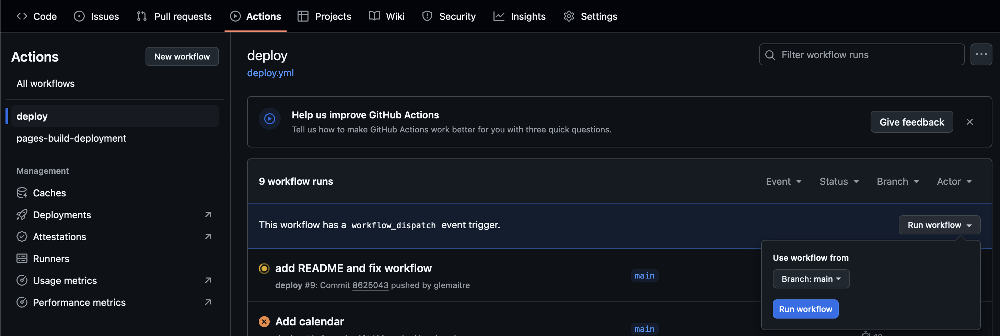

# Site internet de la FSGT 71

## Prérequis

Pour pouvoir générer le site web localement, vous avez uniquement besoin d'installer
`pixi`. Vous pouvez vous référer à la documentation officielle pour l'installer :
[https://pixi.sh/latest/#installation](https://pixi.sh/latest/#installation).

## Générer le site web localement

Vous pouvez générer localement le site web en utilisant `pixi` :

```shell
pixi run build
```

Si vous souhaitez également lancer un serveur local, vous pouvez directement exécuter :

```shell
pixi run preview
```

et consulter le site web à l'adresse [http://localhost:8000](http://localhost:8000).

## Détails concernant certains fichiers internes

Certaines pages web du site sont générées automatiquement en exécutant des scripts
Python. Généralement, les pages web obtiennent les données nécessaires à partir de
différents Google Sheets. Cela signifie que vous devez modifier le contenu de la feuille
de calcul puis exécuter le script pour générer la page web (c'est-à-dire exécuter `pixi
run build`).

### Génération du calendrier

Le script `scripts/generate_calendar.py` génère la page du calendrier basée sur le
Google Sheet suivant :

https://docs.google.com/spreadsheets/d/1SO2i9TXqQL9wSFTjE-GLRONtXmXfvcQ5kYckTm6fY4M/edit?usp=sharing

### Génération de la liste des clubs

Le script `scripts/generate_clubs.py` génère la page de la liste des clubs basée sur le
Google Sheet suivant :

https://docs.google.com/spreadsheets/d/1ocHqS1lCjGVwKTd_ES_L06eOFDN90Jd_Kap3OtZhgVM/edit?gid=0#gid=0

### Génération de la page contenant les rapports des commissions

Les rapports des commissions sont stockés dans un dossier Google Drive dédié avec
un accès en lecture restreint. Le script `scripts/generate_report.py` générera la
page contenant les rapports des commissions. L'intégration continue dispose d'un
accès en lecture seule au dossier Google Drive pour générer la page automatiquement.

Les fichiers dans ces dossiers doivent être nommés selon le format suivant
`JJ_MM_AAAA.pdf` et placés dans le dossier `FSGT 71/Rapport Commission/AAAA`.

## Déclencher une construction du site web sur GitHub Actions

Le site web est automatiquement construit sur GitHub Actions lorsqu'un push est effectué
sur la branche `main`.

Alternativement, vous pouvez déclencher une construction manuellement en allant sur le
[workflow de déploiement](https://github.com/glemaitre/fsgt71velo.github.io/actions/workflows/ci-cd.yml)
et en cliquant sur le bouton "Run workflow" comme montré ci-dessous :



### Attribution et licence

- Logo de Saone-et-Loire - Attributions: created by Ary Prasetyo from Noun Project -
  [Source](https://thenounproject.com/icon/saone-et-loire-department-map-5144602/)
- Logo France - [Source](https://www.svgrepo.com/svg/480941/france-vector)

## Mise à jour du site web pour une nouvelle saison

Lors de la transition vers une nouvelle saison, certaines modifications doivent être
effectuées pour maintenir le site web à jour :

### Archivage des résultats et mise à du calendrier

- **Mise à jour des résultats archivés** : Le script
  `scripts/generate_archive_results.py` a été modifié pour ajouter l'identifiant du
  calendrier de l'année précédente dans le dictionnaire `SHEETS_ID`. Cela permet de
  générer automatiquement les pages de résultats pour les années précédentes.

- **Création du nouveau calendrier** : Il est nécessaire de créer un nouveau dossier
  "20xx" dans le dossier "Calendriers" sur Google Drive et d'y copier le calendrier de
  l'année précédente pour démarrer la nouvelle saison. Il faut que le calendrier soit
  partagé à tout le monde en "Viewer".

- **Mise à jour du script de génération du calendrier** : Il faut éditer le script
  `scripts/generate_calendar.py` pour mettre à jour la variable `SHEET_ID` avec le
  nouvel identifiant du calendrier Google Sheet de la nouvelle saison. Cela permettra de
  générer la page du calendrier avec les données de la nouvelle année.

- **Mise à jour des tests** : Il faut également mettre à jour le fichier de test
  `scripts/tests/test_generate_calendar.py` pour refléter le nouvel identifiant du
  calendrier dans l'assertion de la fonction `test_calendar_google_sheet()`.

- **Mise à jour du script de génération des résultats** : Il faut éditer le script
  `scripts/generate_results.py` pour mettre à jour la variable `SHEET_ID` avec le
  nouvel identifiant du calendrier Google Sheet de la nouvelle saison. Cela permettra de
  générer la page des résultats avec les données de la nouvelle année.

- **Mise à jour des tests des résultats** : Il faut également mettre à jour le fichier
  de test `scripts/tests/test_generate_results.py` pour refléter le nouvel identifiant
  du calendrier dans l'assertion de la fonction `test_calendar_google_sheet()`.
